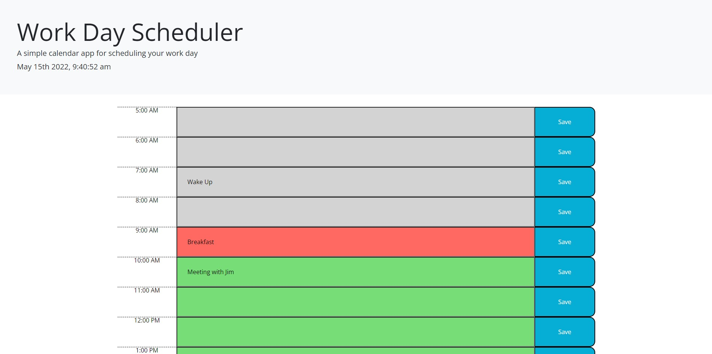

# Daily Planner

This is a daily planner that can be used to keep track of tasks to do throuhgout the day. It includes color-coding to show the current hour as well as past hours and future hours. You can input a task and save it to an individual hour and it will be saved in local memory of the browser and persist on refresh.

## Screenshot

## Link

https://ahageman27.github.io/daily-planner/